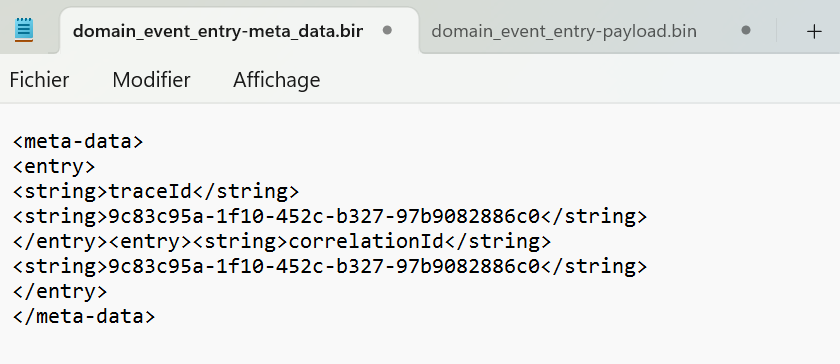
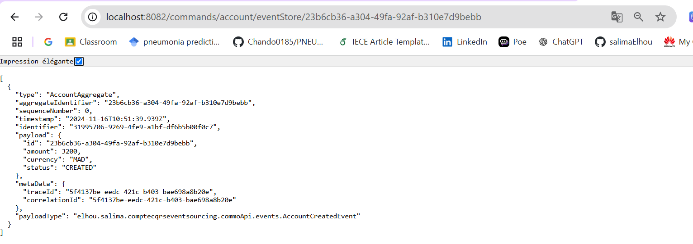
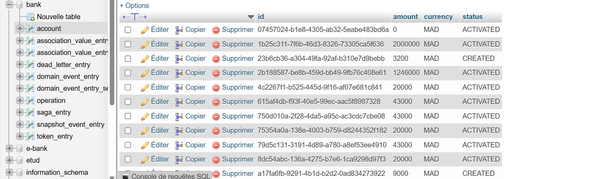

# EL HOU Salima sdia 2

# Gestion de Comptes avec CQRS et Event Sourcing

Cette application permet de gérer des comptes en utilisant les patterns **Command Query Responsibility Segregation (CQRS)** et **Event Sourcing**. Elle est développée avec **Spring Boot** et **Axon Framework**.

## Description
Ce projet est une implémentation des patterns CQRS et Event Sourcing pour gérer des comptes bancaires. Il permet d'exécuter des commandes (création de compte, débit, crédit) et d'obtenir l'état actuel des comptes en se basant sur les événements enregistrés.

## Technologies utilisées
- **Java**
- **Spring Boot**
- **Axon Framework**
- **Event Store**
- **MySql** pour le développement et les tests

## Structure du projet
Le projet est structuré autour des concepts CQRS et Event Sourcing :
- **Commandes** : Création, Débit, Crédit, et Fermeture des comptes.
- **Événements** : Enregistrement d'événements tels que `AccountCreatedEvent`, `AccountDebitedEvent`, etc.

## part 1 UI (Commandes CQRS):

- La partie UI envoie des commandes pour effectuer des actions dans le système, comme créer un nouveau compte bancaire, déposer ou retirer de l’argent. Ces commandes sont gérées par le côté Command du CQRS qui crée ou modifie les états des agrégats.

**BD**

domain event entry **meta_data.bin** :

domain event entry **payload.bin** :

Dans un système **CQRS** avec **Event Sourcing**, chaque changement d'état est enregistré comme un événement distinct dans un Event Store. Ici, cet événement indique que un compte a été créé avec un montant initial de 3200 MAD

1. **Création de compte** : Lorsqu'un compte est créé, un événement `AccountCreatedEvent` est enregistré, avec des informations telles que le montant initial, la devise, et le statut `CREATED`.

2. **Activation du compte** : Après la création, un événement `AccountActivatedEvent` est enregistré pour activer le compte, mettant à jour le statut à `ACTIVATED`.

Chaque événement est stocké de manière permanente dans l'Event Store, et l'état actuel du compte peut être reconstruit en rejouant ces événements dans l'ordre chronologique. Cela garantit l'historisation complète des changements de l’état, offrant ainsi un historique clair et immuable des actions effectuées sur le compte.

## part 2 Affichage de Données en Lecture (Query) :

- La UI interroge le côté Query pour obtenir des informations à jour et les afficher. Avec l'Event Sourcing, ces informations sont généralement récupérées à partir d'une base de données de projection (une vue optimisée pour les requêtes de lecture).

- ALL ACCOUNTS : 

- ACCOUNT BY ID :

